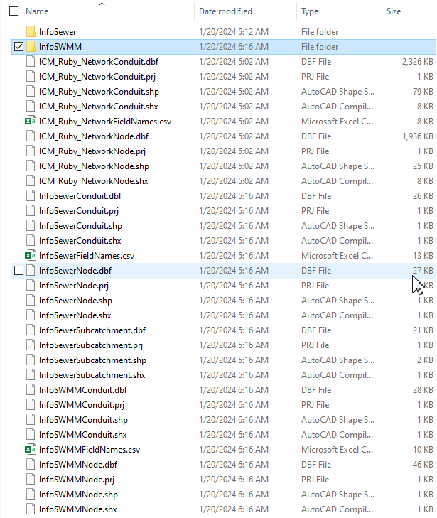

## Code Summary: Exporting Network Data in WSApplication

### Overview
The code snippet is designed to export network data from the WSApplication to a specified format using Ruby.

### Steps Involved

1. **Initialize Network Object**
   - `nw=WSApplication.current_network`: Fetches the current network object.

2. **Define Export Tables**
   - `export_tables = ["sw_node","sw_conduit","sw_subcatchment"]`: An array defining the tables to be exported.

3. **Set Export Options**
   - `exp_options`: A hash to store export options.
     - `ExportFlags = false`: Sets the ExportFlags option (Default = FALSE).
     - `SkipEmptyTables = false`: Determines whether to skip empty tables (Default = FALSE).
     - `Tables = export_tables`: Specifies the tables to be exported. Defaults to exporting all tables if not specified.

4. **Exporting Data**
   - `nw.GIS_export(...)`: The method to export the network data.
     - Format: `'SHP'` (Shapefile format).
     - Options: `exp_options` (The above-defined export options).
     - Destination: `'C:\\Temp\\ICM_Ruby_Network\\InfoSWMM'` (The folder and filename prefix for the exported data).

### Notes
- The code demonstrates the use of Ruby for data export in the WSApplication context.
- It includes options to customize the export process, such as choosing specific tables and setting export flags.
- The destination path and export format are clearly defined.

